# Summary
## Vulnhub

https://www.vulnhub.com/entry/beelzebub-1,742/

## Location
- IP Address: 192.168.1.3
## System Information
- OS: Ubuntu 18.04.4 LTS
- Hostname: beelzebub
- DNS: beelzebub
## Vulnerabilities & Attack Vectors
- Exploit 1: divulgação de informações
- Exploit 2
- Escalation: pwnkit
## Post Exploitation
- Proof
## Credentials
- OS: administrator / xxxxxx
- OS: user / xxxxxx
## System Setup
- Firewall: Enable/Disabled. Will respond to ICMP?
- Essential Services: xxxx (TCP xx)
## Notes
- Máquinas do VulnHub e similares que rodamos localmente sobem em DHCP e não nos informam o IP atribuído. Então primeiro identificamos o IP local (neste cenário, tanto Kali quanto Beelzebub estão sendo virtualizados no VirtualBox em uma rede apartada):

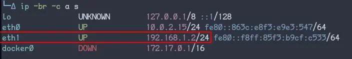
- Depois, identificamos o IP atribuído à máquina Beelzebub:

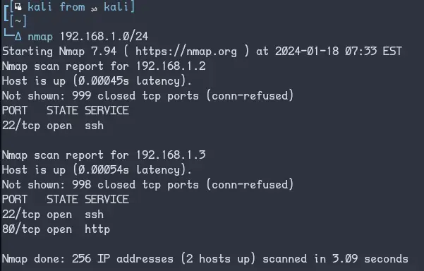

# Service Enumeration
## Port Scan (Nmap)
### All Ports
```txt
└─Δ nmap -p- 192.168.1.3
Starting Nmap 7.94 ( https://nmap.org ) at 2024-01-18 07:36 EST
Nmap scan report for 192.168.1.3
Host is up (0.00016s latency).
Not shown: 65533 closed tcp ports (conn-refused)
PORT   STATE SERVICE
22/tcp open  ssh
80/tcp open  http

Nmap done: 1 IP address (1 host up) scanned in 3.63 seconds
```
### Services
```txt
PORT   STATE SERVICE VERSION
22/tcp open  ssh     OpenSSH 7.6p1 Ubuntu 4ubuntu0.3 (Ubuntu Linux; protocol 2.0)
80/tcp open  http    Apache httpd 2.4.29 ((Ubuntu))
```
## Key Information

### Feroxbuster

revela pastas javascript e phpmyadmin

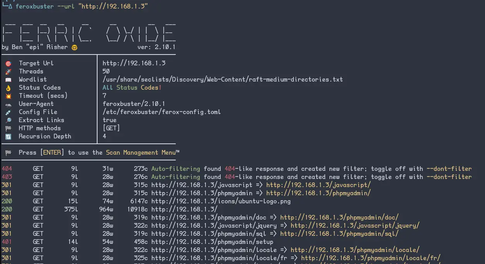

Rodando novamente com extensões php e js, encontra-se /index.php, que contém o comentário 'My heart was encrypted. "beelzebub" somehow hacked and decoded it. -md5'
beelzebub > md5 > d18e1e22becbd915b45e0e655429d487

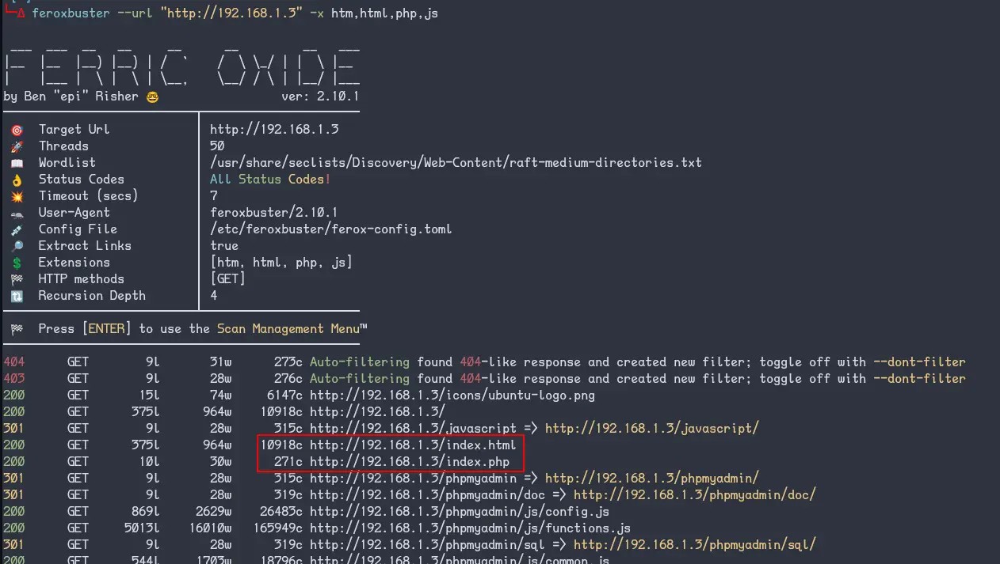

### Navegação manual

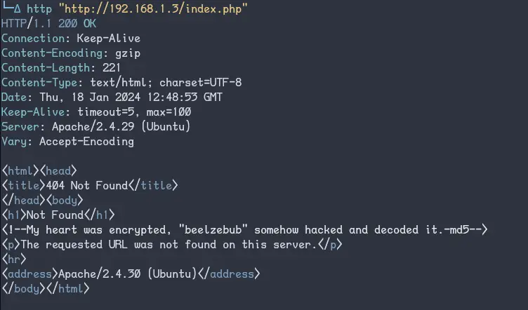

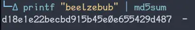

http://192.168.1.3/d18e1e22becbd915b45e0e655429d487 redireciona para http://192.168.1.3/d18e1e22becbd915b45e0e655429d487/ que tenta redirecionar para http://192.168.1.6/d18e1e22becbd915b45e0e655429d487/ e indica ser uma instalação de wordpress ("X-Redirect-By: WordPress")

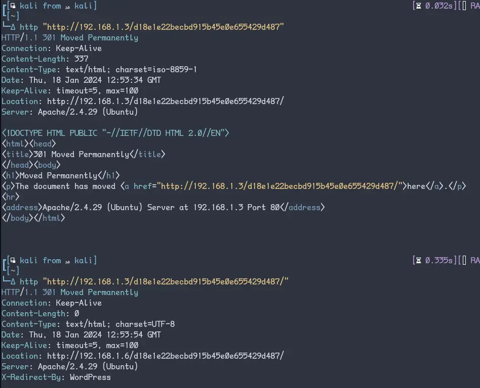

### WPScan

Executar o wpscan nessa instalação necessita do uso das flags "--force" e "--ignore-main-redirect", para ignorar o redirecionamento a um IP inexistente.

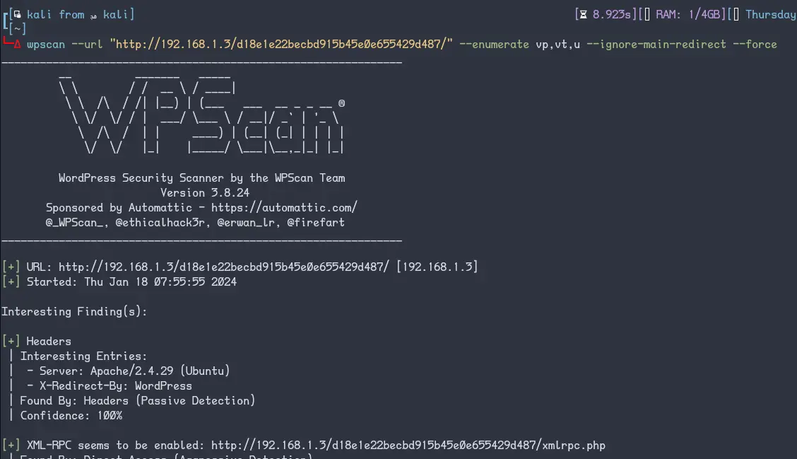

wpscan aponta coisas interessantes: o diretório /wp-content/uploads e os usuários valak e krampus

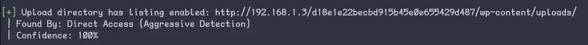

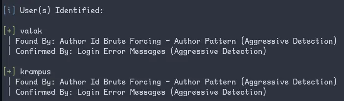

no diretório de uploads http://192.168.1.3/d18e1e22becbd915b45e0e655429d487/wp-content/uploads/ tem duas pastas: 2021 e "Talk To VALAK"

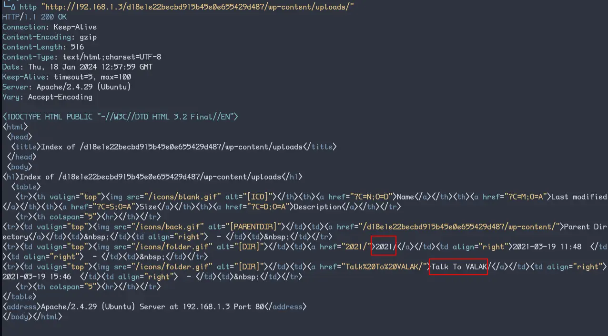

### Mais exploração manual

em http://192.168.1.3/d18e1e22becbd915b45e0e655429d487/wp-content/uploads/Talk%20To%20VALAK/ tem um formulário perguntando o seu nome, com uma caixa de entrada de texto que vem preenchida com "Make a Deal!" e um botão onde diz "Say Hi to VALAK!", com ação direcionada para "index.php" e método post.

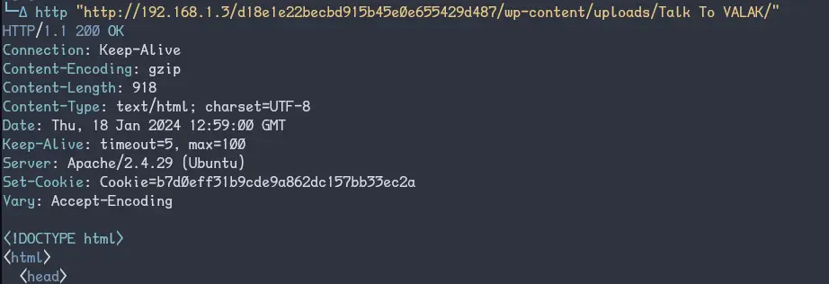

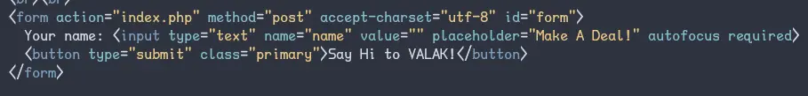

Ao enviar qualquer string, a resposta aparece na tela - mas o interessante está escondido nos cookies. Existe um chamado "Password" com o valor "M4k3Ad3a1"

![[Beelzebub-20240118100050606.webp|727]]

### Finalmente, ssh

Se testarmos o usuário krampus com a senha `M4k3Ad3a1` no ssh, temos acesso!

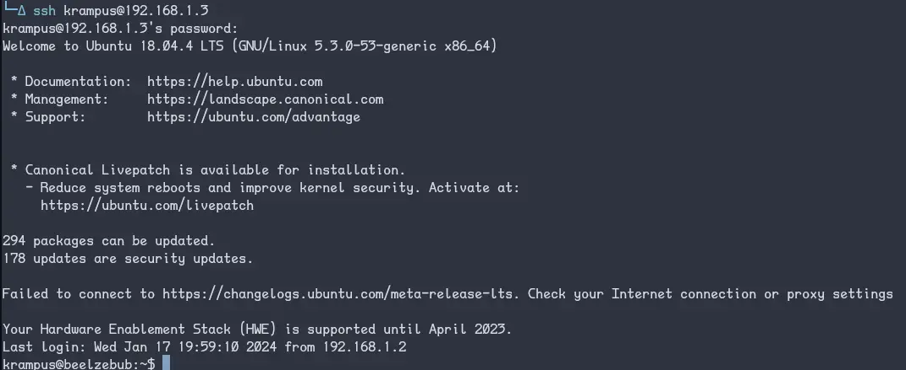

# Exploitation

### Foothold

navegação forçada pra identificar `/index.php`, nos leva a um formulário em `/d18e1e22becbd915b45e0e655429d487/wp-content/uploads/Talk%20To%20VALAK/` que nos dá uma senha.

WPScan nos diz os usuários existentes, valak e krampus.

krampus + senha = acesso via ssh

## Escalation

# Post Exploit

Rodando linpeas a gente identifica vários caminhos pra alcançar a escalada: [pwnkit](https://github.com/ly4k/PwnKit), Baron Samedit, Wing FTP Server e [Serv-U FTP Server](https://www.exploit-db.com/exploits/47009) são os mais interessantes.

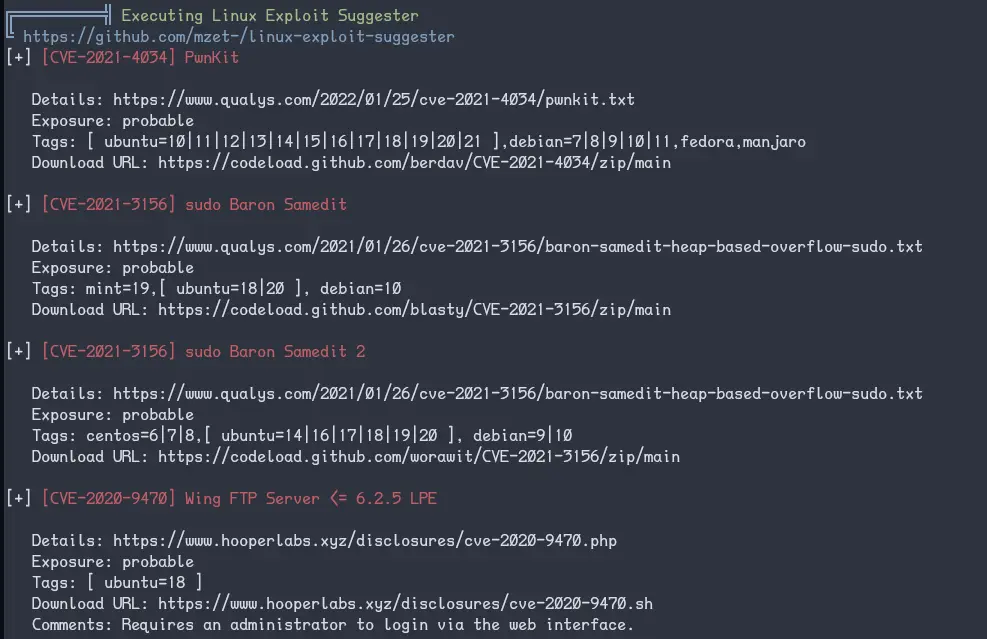

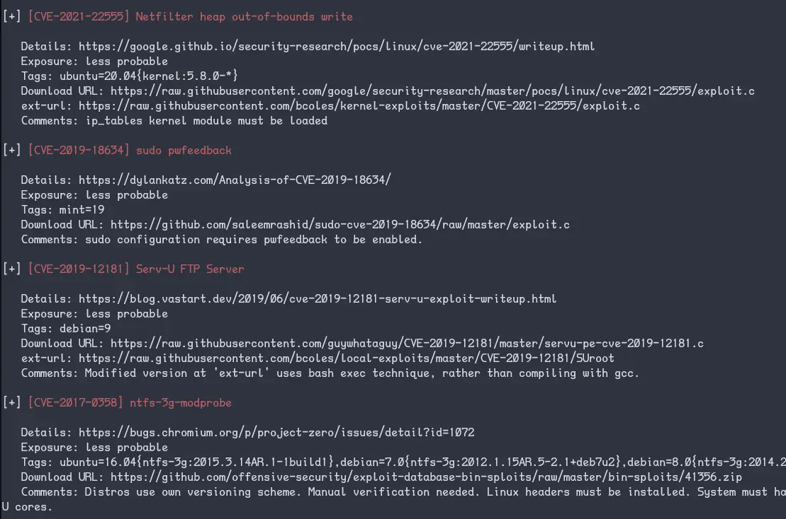

Serv-U FTP possui [um exploit bem exposto](https://www.exploit-db.com/exploits/47009) no Beelzebub por estar no `bash_history`

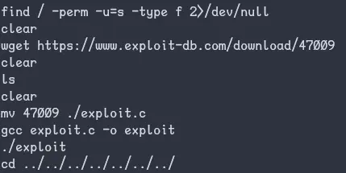

## Hashes


```shell
krampus@beelzebub:~$ ./exploit
uid=0(root) gid=0(root) groups=0(root),4(adm),24(cdrom),30(dip),33(www-data),46(plugdev),116(lpadmin),126(sambashare),1000(krampus)
opening root shell
# cat /root/root.txt
8955qpasq8qq807879p75e1rr24cr1a5
# cat /etc/passwd
root:x:0:0:root:/root:/bin/bash
krampus:x:1000:1000:,,,:/home/krampus:/bin/bash
# cat /etc/shadow
root:$6$0s0z2aW8$JMKbequvDyWeGIyWPr/gdu22OSBXHoDtoF/Uz/xFytPJkiUEe7t60L6iOLi1jT5D4hoZ7qca8sebQxeIKUNjN0:18705:0:99999:7:::
krampus:$6$18iThHtT$3tpuOkUHkKMl4UiYm/k.kROWn4xHGlNHp4IiEey1Y4ovk4mkoGaouFKRxyHYjrQ7al.fxZG1nik4oiMJtHWd/.:18705:0:99999:7:::
```

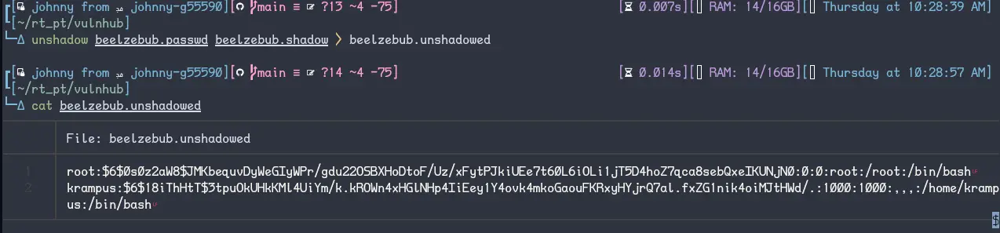

